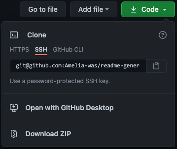

# ReadMe Generator &nbsp;&nbsp;&nbsp;

## Description
This app is a professional README.md generator. The app is executed from the command line. On installation, the user may navigate to the command line and answer a series of prompts about their application and a professional-quality README file is generated. The generated README contains a project description, license, table of contents, and instructions for installation, usage, contributions, and tests. A sample README created using the app can be found [here](https://github.com/Amelia-was/readme-generator/blob/main/Sample/README-SAMPLE.md).

# Table of Contents
1. [Installation](#installation)
2. [Usage](#usage)
3. [Questions](#questions)
4. [License](#license)

## Installation
To use this app, you must have [node.js](https://nodejs.org/en/) installed. A basic knowledge of the command line is also required. See [here](https://datacarpentry.org/shell-genomics/02-the-filesystem/index.html) for help navigating directories in the command line.

1. To install the app, clone the respository above, or download as a .zip file.

2. In the command line, navigate to the directory containing the downloaded repsitory.
3. Install inquirer by typing the following in the command line:
`npm install inquirer`

## Usage
1. In the root directory of the app, begin creating your README by entering `node index.js` in the command line.
2. Answer the prompts. Some of the prompts are required.
3. A professional README containing your entered information will be in the '/dist' folder. You may navigate to it in the command line from the root directory of the app by entering:
`cd dist` 
`open readme.md`

A video walkthrough of the app can be found [here](https://drive.google.com/file/d/1e_USq2vzN_3kWrAblJcVjEfVAUJM7-LL/view?usp=sharing).

## Questions
For additional questions, contact Amelia:

GitHub: [amelia-was](https://github.com/amelia-was)

## License
Under the MIT license, this material is free to modify and distribute for commercial or private use. See [here](https://opensource.org/licenses/MIT) for more details.
